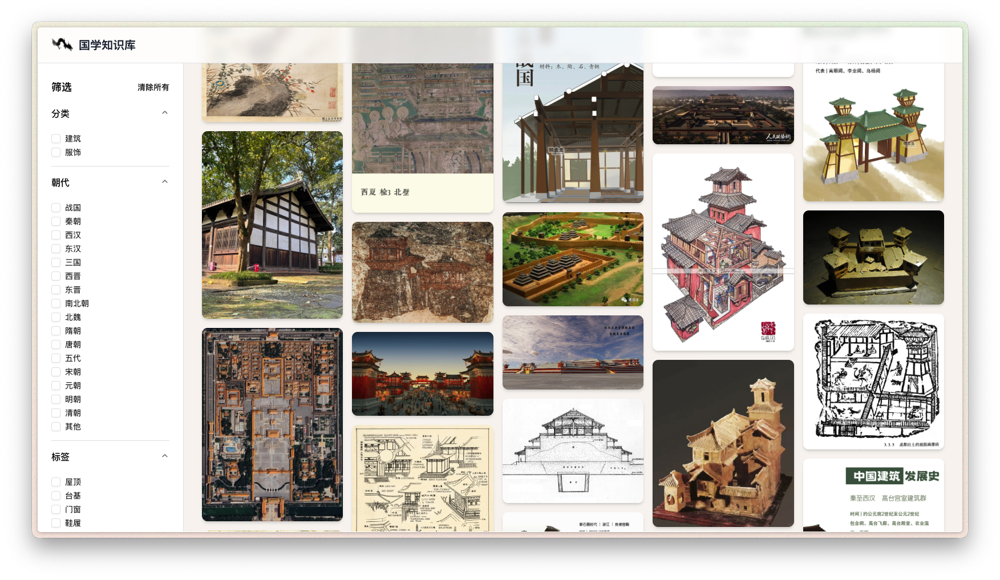

# Awesome Photo Gallery
<p align="center">
  
</p>

<p align="center">
    【<a href="doc/README-Chinese.md">中文</a> | <a href="doc/README-English.md">English</a> | <a href="doc/README-Japanese.md">Japanese</a>】
</p>

## 📖 概述
这是一个可自由配置的图库展示系统，专为需要快速搭建带有标签过滤功能的图片浏览平台而设计。用户只需填入自己的图片资源和配置信息，即可快速部署一个功能完整的图库系统。该系统支持按分类、时间、标签等多维度筛选，提供优雅的瀑布流展示效果。

网站展示效果：
<p align="center">
  
</p>

## ❓ Awesome Photo Gallery 能做什么？

#### 1. 智能图片管理
系统支持灵活的图片分类管理，包括自定义分类、时间标记和多标签系统。通过 JSON 配置文件，用户可以轻松管理大量图片资源，每张图片都包含详细的元数据信息。

#### 2. 多维度筛选功能
提供强大的筛选功能，用户可以通过以下维度快速定位目标图片：
- **分类筛选**：按图片类别筛选
- **时间筛选**：按时间筛选
- **标签筛选**：按自定义标签筛选
- **组合筛选**：支持多条件组合筛选

#### 3. 响应式瀑布流布局
采用现代化的瀑布流布局设计，自适应不同屏幕尺寸，提供流畅的浏览体验。支持图片懒加载和性能优化，确保在大量图片情况下依然保持良好的用户体验。

<p align="center">
  
</p>

### 🖥️ 快速开始

请按照以下步骤配置您的图库：

1. **克隆项目仓库：** 使用以下命令克隆仓库：

```bash
git clone https://github.com/VintLin/awesome-photo-gallery.git
```

2. **配置数据文件：** 打开项目目录，配置您的图片数据。项目需要 Node.js 18 或更高版本：

```bash
cd awesome-photo-gallery
```

3. **安装依赖：** 安装项目所需的依赖包：

```bash
pnpm install
```

4. **配置图片资源：** 将您的图片文件放入 `/public/images/` 目录，并按分类组织：

```bash
# 图片目录结构示例
public/images/
└── your-category/   # 自定义分类
```

5. **配置数据文件：** 编辑 `/data/` 目录下的配置文件：

```bash
# 编辑主数据文件
vim data/images.json

# 编辑元数据配置
vim data/metadata.json
```

6. **启动开发服务器：** 配置完成后启动项目：

```bash
# 开发模式
pnpm dev

# 生产构建
pnpm build && pnpm start
```

### 📁 数据配置说明

#### `/data` 目录配置

该目录包含所有的数据配置文件：

- `images.json` (必需): 主数据文件，包含所有图片的详细信息
- `metadata.json` (必需): 元数据配置，包含分类、时间、标签等信息
- 按分类拆分的数据文件（可选）

#### `images.json` 数据格式：

```json
{
  "version": "1.0.0",
  "lastUpdated": "2024-01-01",
  "description": "您的图库描述",
  "images": [
    {
      "id": 1,
      "name": "图片名称",
      "url": "/images/category/filename.jpg",
      "height": 750,
      "category": "分类名称",
      "dynasty": "时间标记",
      "tags": ["标签1", "标签2"],
      "description": "详细描述",
      "source": "来源信息"
    }
  ]
}
```

#### `metadata.json` 配置格式：

```json
{
  "categories": ["分类1", "分类2", "您的分类"],
  "dynasties": ["时间1", "时间2", "您的时间"],
  "tags": {
    "分类1": ["标签1", "标签2", "标签3"],
    "分类2": ["标签A", "标签B", "标签C"]
  },
  "statistics": {
    "totalImages": 100,
    "categoryCounts": {
      "分类1": 50,
      "分类2": 50
    }
  }
}
```

#### `/public` 目录配置

将您的图片文件按分类放入对应目录：

```bash
public/
├── images/
│   └── your-category/    # 您的自定义分类
└── web_icon.png         # 网站图标
```

### 🚀 部署方式

#### 方式一：Docker 部署（推荐）

```bash
# 使用 Docker Compose 部署
docker-compose -f config/docker-compose.yml up -d

# 或者直接构建运行
docker build -t awesome-photo-gallery .
docker run -p 3000:3000 -v ./public/images:/app/public/images:ro awesome-photo-gallery
```

#### 方式二：PM2 部署

```bash
# 构建项目
pnpm build

# 使用 PM2 启动
pm2 start config/ecosystem.config.js

# 或者直接启动
pm2 start npm --name "awesome-photo-gallery" -- start
```

#### 方式三：传统部署

```bash
# 构建项目
pnpm build

# 启动生产服务器
pnpm start
```

### 命令行参数说明

开发和部署过程中的常用命令：

- `pnpm dev`: 启动开发服务器（默认端口 3000）
- `pnpm build`: 构建生产版本
- `pnpm start`: 启动生产服务器
- `pnpm lint`: 代码检查

### 使用示例

以下是一些配置示例：

```bash
# 快速开始 - 使用示例数据
pnpm dev

# 部署到生产环境
pnpm build
PORT=8080 pnpm start

# 使用 Docker 快速部署
docker-compose up -d
```

## 🛠️ 技术栈

- **前端框架**：Next.js 15 + React 19
- **UI 组件**：Radix UI + Tailwind CSS
- **开发语言**：TypeScript
- **包管理器**：pnpm
- **部署方案**：Docker + PM2

## ✨ 主要特性

- 📸 **高性能图片加载**：懒加载 + 虚拟滚动优化
- 🔍 **智能筛选系统**：多维度组合筛选
- 📱 **完全响应式**：适配各种设备
- 🎨 **瀑布流布局**：美观的展示效果
- ⚡ **快速配置**：JSON 配置即可使用
- 🔧 **高度可定制**：支持自定义分类和标签

## 👨‍💻‍ 贡献者

<a href="https://github.com/VintLin/awesome-photo-gallery/contributors">
  
</a>

Made with [contrib.rocks](https://contrib.rocks).

## ⚖️ 许可证

- 源代码许可：本项目的源代码采用 MIT 许可证。该许可证允许在遵守 MIT 许可证条款的前提下使用、修改和分发代码。
- 项目开源状态：本项目确实是开源的；但是，这一指定主要面向非商业用途。虽然我们鼓励社区为研究和非商业应用进行协作和贡献，但重要的是要注意，将项目组件用于商业目的需要单独的许可协议。

## 🌟 Star History

[](https://star-history.com/#VintLin/awesome-photo-gallery&Date)

## 📬 联系方式

如果您有任何问题、反馈或想要联系，请随时通过邮件联系我们： [vintonlin@gmail.com](mailto:vintonlin@gmail.com)
