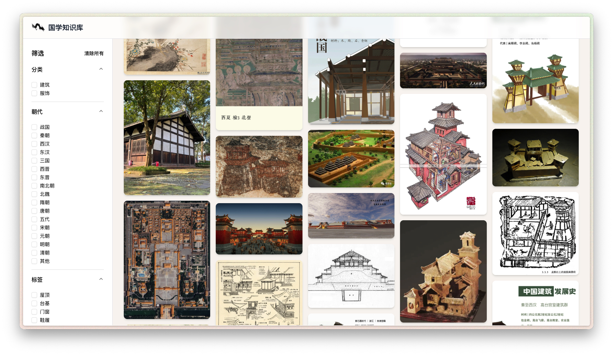

# Awesome Photo Gallery
<p align="center">
  
</p>

<p align="center">
    【<a href="../README.md">ホーム</a> | <a href="README-Chinese.md">中文</a> | <a href="README-English.md">English</a>】
</p>

## 📖 概要
これは自由に設定可能な写真ギャラリーシステムで、タグフィルタリング機能を備えた画像閲覧プラットフォームを迅速に構築したい方向けに設計されています。ユーザーは自分の画像リソースと設定情報を入力するだけで、機能的に完全なギャラリーシステムを素早くデプロイできます。このシステムはカテゴリ、時代、タグによる多次元フィルタリングをサポートし、エレガントなウォーターフォールレイアウト表示を提供します。

ウェブサイトの展示効果：
<p align="center">
  
</p>

## ❓ Awesome Photo Gallery は何ができますか？

#### 1. スマート画像管理
システムは柔軟な画像分類管理をサポートし、カスタムカテゴリ、時代マーカー、マルチタグシステムを含みます。JSON設定ファイルを通じて、ユーザーは大量の画像リソースを簡単に管理でき、各画像には詳細なメタデータ情報が含まれます。

#### 2. 多次元フィルタリング機能
強力なフィルタリング機能を提供し、ユーザーは以下の次元でターゲット画像を迅速に特定できます：
- **カテゴリフィルタリング**：画像カテゴリによるフィルタリング
- **時代フィルタリング**：時代によるフィルタリング
- **タグフィルタリング**：カスタムタグによるフィルタリング
- **組み合わせフィルタリング**：複数条件の組み合わせフィルタリングをサポート

#### 3. レスポンシブウォーターフォールレイアウト
モダンなウォーターフォールレイアウトデザインを採用し、異なる画面サイズに自動適応し、スムーズな閲覧体験を提供します。画像の遅延読み込みとパフォーマンス最適化をサポートし、大量の画像がある場合でも良好なユーザーエクスペリエンスを保証します。

<p align="center">
  
</p>

### 🖥️ クイックスタート

以下の手順でギャラリーを設定してください：

1. **リポジトリのクローン：** 以下のコマンドでリポジトリをクローンします：

```bash
git clone https://github.com/VintLin/awesome-photo-gallery.git
```

2. **データファイルの設定：** プロジェクトディレクトリを開き、画像データを設定します。プロジェクトはNode.js 18以上が必要です：

```bash
cd awesome-photo-gallery
```

3. **依存関係のインストール：** プロジェクトに必要な依存関係パッケージをインストールします：

```bash
pnpm install
```

4. **画像リソースの設定：** 画像ファイルを `/public/images/` ディレクトリに配置し、カテゴリごとに整理します：

```bash
# 画像ディレクトリ構造の例
public/images/
└── your-category/   # カスタムカテゴリ
```

5. **データファイルの設定：** `/data/` ディレクトリ下の設定ファイルを編集します：

```bash
# メインデータファイルを編集
vim data/images.json

# メタデータ設定を編集
vim data/metadata.json
```

6. **開発サーバーの起動：** 設定完了後、プロジェクトを起動します：

```bash
# 開発モード
pnpm dev

# 本番ビルド
pnpm build && pnpm start
```

### 📁 データ設定説明

#### `/data` ディレクトリ設定

このディレクトリにはすべてのデータ設定ファイルが含まれます：

- `images.json` (必須): メインデータファイル、すべての画像の詳細情報を含む
- `metadata.json` (必須): メタデータ設定、カテゴリ、時代、タグなどの情報を含む
- カテゴリ別に分割されたデータファイル（オプション）

#### `images.json` データ形式：

```json
{
  "version": "1.0.0",
  "lastUpdated": "2024-01-01",
  "description": "あなたのギャラリーの説明",
  "images": [
    {
      "id": 1,
      "name": "画像名",
      "url": "/images/category/filename.jpg",
      "height": 750,
      "category": "カテゴリ名",
      "dynasty": "時代マーカー",
      "tags": ["タグ1", "タグ2"],
      "description": "詳細説明",
      "source": "ソース情報"
    }
  ]
}
```

#### `metadata.json` 設定形式：

```json
{
  "categories": ["カテゴリ1", "カテゴリ2", "あなたのカテゴリ"],
  "dynasties": ["時代1", "時代2", "あなたの時代"],
  "tags": {
    "カテゴリ1": ["タグ1", "タグ2", "タグ3"],
    "カテゴリ2": ["タグA", "タグB", "タグC"]
  },
  "statistics": {
    "totalImages": 100,
    "categoryCounts": {
      "カテゴリ1": 50,
      "カテゴリ2": 50
    }
  }
}
```

#### `/public` ディレクトリ設定

画像ファイルをカテゴリごとに対応するディレクトリに配置します：

```bash
public/
├── images/
│   └── your-category/    # あなたのカスタムカテゴリ
└── web_icon.png         # ウェブサイトアイコン
```

### 🚀 デプロイ方法

#### 方法1：Dockerデプロイ（推奨）

```bash
# Docker Composeを使用してデプロイ
docker-compose -f config/docker-compose.yml up -d

# または直接ビルドして実行
docker build -t awesome-photo-gallery .
docker run -p 3000:3000 -v ./public/images:/app/public/images:ro awesome-photo-gallery
```

#### 方法2：PM2デプロイ

```bash
# プロジェクトをビルド
pnpm build

# PM2で起動
pm2 start config/ecosystem.config.js

# または直接起動
pm2 start npm --name "awesome-photo-gallery" -- start
```

#### 方法3：従来のデプロイ

```bash
# プロジェクトをビルド
pnpm build

# 本番サーバーを起動
pnpm start
```

### コマンドライン引数説明

開発およびデプロイプロセスでよく使用されるコマンド：

- `pnpm dev`: 開発サーバーを起動（デフォルトポート 3000）
- `pnpm build`: 本番バージョンをビルド
- `pnpm start`: 本番サーバーを起動
- `pnpm lint`: コードチェック

### 使用例

以下はいくつかの設定例です：

```bash
# クイックスタート - サンプルデータを使用
pnpm dev

# 本番環境にデプロイ
pnpm build
PORT=8080 pnpm start

# Dockerで迅速デプロイ
docker-compose up -d
```

## 🛠️ 技術スタック

- **フロントエンドフレームワーク**：Next.js 15 + React 19
- **UIコンポーネント**：Radix UI + Tailwind CSS
- **開発言語**：TypeScript
- **パッケージマネージャー**：pnpm
- **デプロイソリューション**：Docker + PM2

## ✨ 主な機能

- 📸 **高性能画像ロード**：遅延ロード + 仮想スクロール最適化
- 🔍 **スマートフィルタリングシステム**：多次元組み合わせフィルタリング
- 📱 **完全レスポンシブ**：様々なデバイスに対応
- 🎨 **ウォーターフォールレイアウト**：美しい表示効果
- ⚡ **迅速設定**：JSON設定ですぐに使用可能
- 🔧 **高度にカスタマイズ可能**：カスタムカテゴリとタグをサポート

## 👨‍💻‍ 貢献者

<a href="https://github.com/VintLin/awesome-photo-gallery/contributors">
  
</a>

Made with [contrib.rocks](https://contrib.rocks).

## ⚖️ ライセンス

- ソースコードライセンス：このプロジェクトのソースコードはMITライセンスを採用しています。このライセンスは、MITライセンスの条項に従ってコードの使用、変更、配布を許可します。
- プロジェクトオープンソースステータス：このプロジェクトは確実にオープンソースです。ただし、この指定は主に非商業用途を対象としています。研究および非商業アプリケーションのためのコミュニティからの協力と貢献を奨励していますが、商業目的でプロジェクトコンポーネントを使用する場合は別途ライセンス契約が必要であることに注意することが重要です。

## 🌟 Star History

[](https://star-history.com/#VintLin/awesome-photo-gallery&Date)

## 📬 連絡先

ご質問、フィードバック、またはご連絡をご希望の場合は、いつでもメールでお気軽にお問い合わせください： [vintonlin@gmail.com](mailto:vintonlin@gmail.com)
